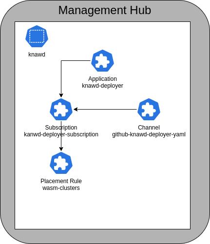

# rhacm

A collection of yamls file to configure the [deployer](https://github.com/knawd/deployer) in a Red Hat Advanced Cluster Management instance.


## install

```
git clone https://github.com/knawd/rhacm
cd rhacm
kubectl create -f ns.yaml -f wasm-placement-rule.yaml -f application.yaml
```

## Components

|Type|Name|Notes|
|---|---|---|
|**Namespace**|knawd|The namespace to deploy the system into. If this namespace already exists then don't use this file|
|[**PlacementRule**](https://access.redhat.com/documentation/en-us/red_hat_advanced_cluster_management_for_kubernetes/2.7/html-single/applications/index#placement-rules)|wasm-clusters|a label based placement rule - You may prefer to use an alternative in the [PlacementRules Samples](https://access.redhat.com/documentation/en-us/red_hat_advanced_cluster_management_for_kubernetes/2.1/html-single/manage_applications/index#placement-rule-samples)|
|[**Channel**](https://access.redhat.com/documentation/en-us/red_hat_advanced_cluster_management_for_kubernetes/2.7/html-single/applications/index#channels)|github-knawd-deployer-yaml|Configuration for the [helm chart repo](https://knawd.github.io/deployer/)|
|[**Application**](https://access.redhat.com/documentation/en-us/red_hat_advanced_cluster_management_for_kubernetes/2.7/html-single/applications/index#applications)|knawd-deployer|The group of Kubernetes resources that make up the deployer application|
|[**Subscription**](https://access.redhat.com/documentation/en-us/red_hat_advanced_cluster_management_for_kubernetes/2.7/html-single/applications/index#subscriptions)|kanwd-deployer-subscription|The cluster configuration that refers to the channel|



